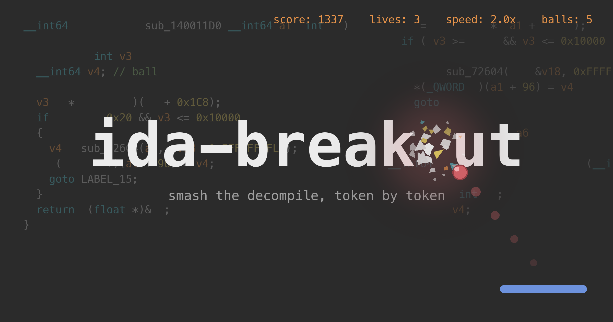
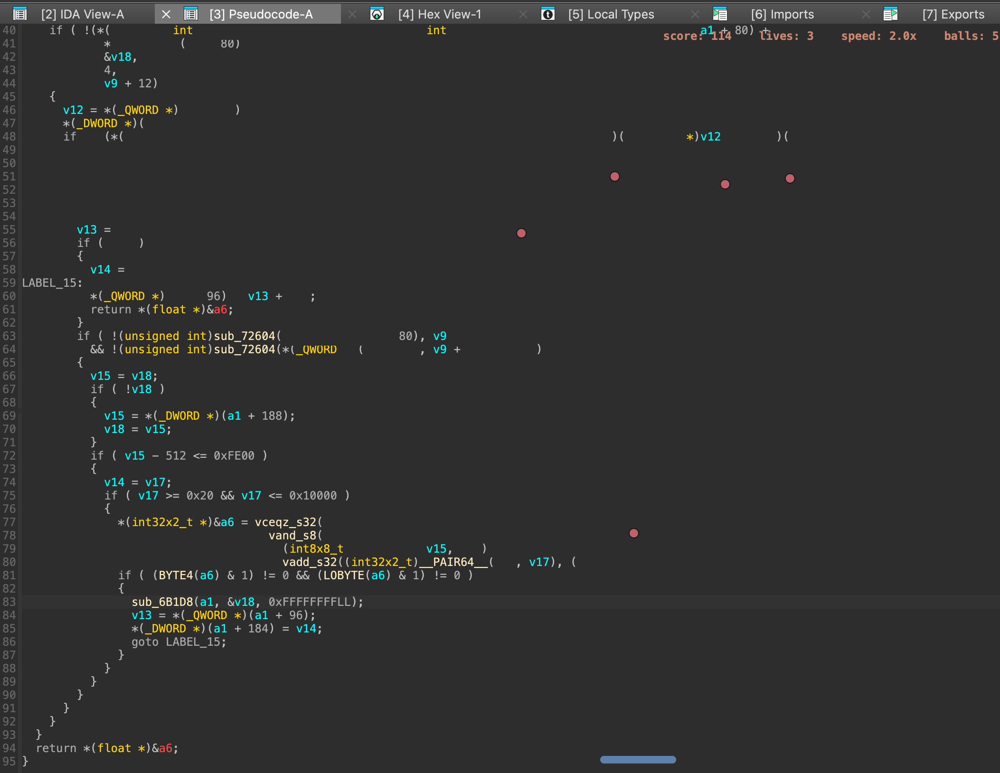

# ida-breakout

<p align="center">
  
</p>

[English](README.md) | **한국어**

IDA Pro의 Pseudocode 뷰를 그대로 Breakout(벽돌깨기) 게임으로 만드는
플러그인. 디컴파일된 C 소스의 변수명, 키워드, 숫자가 그대로 벽돌이 되고,
밑에 깔린 디컴파일 결과는 게임 중에도 비쳐 보임.

핫키 한 번이면 지금 보고 있는 함수가 게임판이 되고, 다시 누르면 원래
디컴파일 결과로 돌아옴.

[vim-game-code-break](https://github.com/johngrib/vim-game-code-break)에서 영감을 받았음.

## 요구사항

- IDA Pro 9.0+
- Hex-Rays Decompiler 라이선스
- PySide6 (IDA 9.x 번들)
- numpy (IDA의 Python에 없으면 `pip install numpy`로 설치)

## 설치

레포를 IDA 플러그인 폴더에 심링크:

```sh
git clone https://github.com/hyuunnn/ida-breakout.git
ln -s "$(pwd)/ida-breakout" ~/.idapro/plugins/ida-breakout
```

IDA를 재시작하면 `ida_breakout_entry.py`가 자동 로드됨.

## 사용법



Pseudocode 뷰 (`F5` 디컴파일 창)에서:

| 동작              | 키                                                              |
| ----------------- | --------------------------------------------------------------- |
| 시작              | `Ctrl-Alt-K` *또는* 우클릭 → "ida-breakout: Start brick break"     |
| 패들 이동         | `←` / `→` (또는 `h`/`l`, `a`/`d`)                                |
| 공 발사           | `Space`                                                         |
| 재시작            | `R` (WIN / LOSE 후)                                              |
| 종료              | `Ctrl-Alt-K` (토글; `Esc`는 IDA navigate-back과 겹쳐 사용 안 함)   |

게임은 디컴파일된 함수 위에 투명 오버레이로 깔리고, 벽돌은 실제 렌더된
텍스트 픽셀에서 추출됨 — 화면에 보이는 글자가 그대로 부서지는 대상.

메커니즘 요약:

- 표준 Breakout 패들 물리: 반사 시 magnitude(속력) 보존, 패들 위치는
  각도만 결정 (속도는 변하지 않음).
- 멀티볼: 점수 15점마다 추가 공 분기 (최대 5개).
- 부순 벽돌 수에 비례한 점진적 가속 (최대 2.0x).
- WIN / LOSE 시 `[R] restart   [Ctrl-Alt-K] exit` 배너 표시 — 자동 종료 없음.

## 문제 해결

핫키를 눌러도 반응이 없거나 "no ink detected" 경고가 뜨면, 픽셀 기반 벽돌
검출기가 해당 IDA 빌드나 컬러 테마를 아직 인식하지 못하는 경우일 가능성이
큽니다. 플러그인은 IDA Output 창에 진단 로그(`ida_breakout_lib` 로거, INFO
레벨)를 남깁니다 — 감지된 viewport 클래스, 샘플링된 배경색, 라인/벽돌 개수.
GitHub 이슈에 이 로그를 붙여 주시면 대부분 클래스명 한 줄 추가로 지원할 수
있습니다.

로그를 끄려면 IDA Python 콘솔에서:

```python
import logging
logging.getLogger("ida_breakout_lib").setLevel(logging.WARNING)
```

